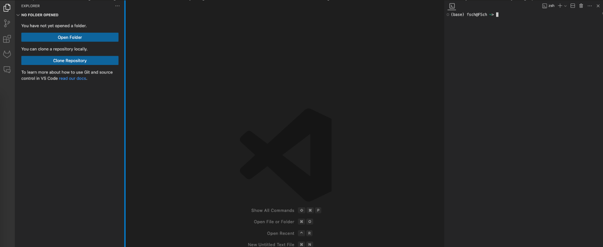

# Modelling in climate economics

For this hands-on part of the lecture, we are gonna be working in [`Julia`](https://julialang.org). Specifically, we're gonna be using the [`Mimi` package](https://www.mimiframework.org/Mimi.jl/stable/).

Most of the materials to start with are gonna be included in a Jupyter Notebook. So this `README` will guide you until you're gonna be at the stage where you can yourself open the Jupyter Notebook in your local VS Code installation and play around with the code. But let's start step by step.

## Homework (assigned April 11th, due April 25th)

You don't have to submit anything, but do try to go through the following steps by yourself:

1. Install Julia
1. Install VS Code
3. Open the [Jupypter Notebook](./Intro_Notebook.ipynb)
4. Test your Julia installation
6. Be happy if it all went smoothly, don't despair in case it didn't :)
<!-- 3. Install Mimi
4. Download DICE2016
5. Run and explore DICE2016 -->

## 1. Install Julia

Go to [https://julialang.org/downloads/](https://julialang.org/downloads/) and select the current stable release file according to your operating system.

If you're brave, you follow the suggestion of the box and install Julia using your terminal. You'll just need to open your command prompt (Windows) or terminal (Mac and Linux), paste in the one line of code and press `Enter`. This method is the most fail-safe.

## 2. Installing VS Code

To install VSC, see [here](../README.md#integrated-development-environment-ide). Make sure you have the Jupyter and the Julia extension installed. Installing the Jupyter extension should automatically install `Jupyter Cell Tags`, `Jupyter Slide Show`, `Jupyter Keymap`, and `Jupyter Notebook Renderer`. In case it doesn't, do install those extensions as well.

Normally, the VS Code Julia extension should be able to find your Julia installation and connect them. In case you run into problems later (if your Julia installation is not found), you might have to configure your VS Code Julia extension with the exact path of the Julia installation. You can read up on how to do this [here](https://www.julia-vscode.org/docs/dev/gettingstarted/#Installation-and-Configuration).

From now on, VS Code will be our golden cage from which we will do everything Julia and Mimi. So it's worth the investment to get to know the basic structure. Here's how it looks if you don't have anything open:


You can see three parts: Left, the side bar with _Explorer_, _Source Control_ (git), _Extensions_, and more. In the middle, the space where your files will be opened. And on the right (that's how I configured it because I love vertical screen space; chances are for your installation it's on the bottom) you have the terminal. Terminals are scary and cool at the same time, I'll add a little intro in a box.

## 3. Opening the Jupyter Notebook

Now, you should be able to open a Jupyter Notebook with the VS Code installation on your computer. The simplest way is to manually download the file and the folder it's in from the Github website, and then open it with VS Code.
To manually download a git repository, click on the top-right green box that says `< > Code` and select `Download ZIP`.
A better way of doing it would be to open a Github repository directly through VS Code, as explained [here](https://code.visualstudio.com/docs/sourcecontrol/intro-to-git#_open-a-git-repository).
The pro way of doing it is to use the `git clone` command to clone the whole Github repository and then open it with VS Code. If you're into nerdy stuff, I'll add a [short box on `git`](#git), otherwise just move on.

If you're wondering what exactly a Jupyter Notebook is, see [here](#jupyter-notebooks) in the [section with useful nerdy stuff](#section-with-useful-nerdy-stuff).

The easiest way of opening anything in VS Code is to open the folder that contains it. So first, open VS Code itself and then type `Ctrl+O` on Windows/Linux or `⌘O` on Mac to open the folder that contains the Notebook. Most likely, this folder is called `adv_env_econ_24`. Once you have successfully opened the folder within VS Code, you can use the file explorer in the left sidebar to navigate to the Notebook and open it. You will also be able to find this README file here in the explorer under the path `adv_env_econ_24/modelling/README.md`.

The rest of the homework will take place within the now (hopefully) opened [notebook](./Intro_Notebook.ipynb). In case you didn't manage to open it (and your colleagues couldn't help), feel free to [contact me](mailto:felix.schaumann@uni-hamburg.de).

## 4. Using `.jl` Julia file instead of a Jupyter Notebook

Some of you have problems with Jupyter Notebooks. You can of course run all Julia code outside of it, it just doesn't look as nice. But the nice thing is that normal Julia files also allow to execute code in cells.

A cell is a section of code that is executed at the same time. It looks like this:
```julia
#%% this is the beginning of a cell

some_code_to_be_executed = here

#%% this is the end of the cell
```
[Here](https://www.julia-vscode.org/docs/stable/userguide/keybindings/#Keyboard-shortcuts) are some useful keyboard shortcuts. Importantly:

- execute one line: `Ctrl+Enter`
- execute one line and move to the next: `Shift+Enter`
- execute one cell: `Alt+Enter`
- execute one line and move to the next: `Alt+Shift+Enter`

## 5. Tutorials

There are five tutorials, all of them as Jupyter notebooks, some of them also as `.jl` files:

1. [running_DICE.ipynb](./running_DICE.ipynb) (or [.jl](./running_DICE.jl)) and [running_META.ipynb](./running_META.ipynb)
2. [optimising_DICE.ipynb](./optimising_DICE.ipynb) (or [.jl](./optimising_DICE.ipynb))
3. [changing_parameters.ipynb](./changing_parameters.ipynb) (or [.jl](./changing_parameters.jl)) 
4. [changing_components.ipynb](./changing_components.ipynb)
5. [plotting_results.ipynb](./plotting_results.ipynb)

___

## Section with useful nerdy stuff

### The terminal

> **Speaking to the computer directly**
> The terminal is the place on your computer where you interact with the machine only through typing. This is kind of limiting and intimidating, you might find, but it also allows for unrivalled precision and reproducibility.
> Commands may seem unintuitive and hard to understand, but they do exactly what they're supposed to do, and can be easily automated.
>
> When you're in the terminal, it is like you are always in the file explorer. The path you're in will always be shown by your system. You can change the folder you're in with the command `cd` (change directory), and explore the folder you're in with `ls` (list). You can make a new directory (`mkdir`), and you can do all sorts of fancy stuff like downloading Julia or executing a python script you wrote.
>
> The real power of the terminal is harnessed once you want to do more than one thing at a time. You could, for example, rename all PNG files of a folder according to a certain rule. In the graphical file explorer, that would mean a painful amount of clicking and typing, but in the terminal it would only require one carefully crafted line of code.

### Git

> **The nerdy way of doing things properly**
> 
> `git` is a (the) version control system. That means, it's a tool that allows you to track changes within a folder over time. You will never, ever have to name documents `Document_v1`, `Document_final`, or `Document_really_properly_final` anymore, but instead you can keep your one `Document` file and use git as a time machine to change between different versions.
>
> The most important element of git is called a commit. A commit is a snapshot of your project to which you can always go back. If you check out our Github repository, you'll see the amount of commits that we have done on the rop right, and you could click on them to transparently see how we sequentially put together this text.
> But first, if you are in a folder for which you want to use git version control, you have to run `git init`. Then, once you change some files, you have to `git add` them, that is similar to putting things in the shopping cart while online-shopping. Only then you can commit the things you added (they are called "staged).
>
> In a collaborative setting, one often has a shared remote repository, for example on Github. One can `git clone` this repository to make a local copy of it. Then, if you change something in your local repository, you can `git push` it to the remote, or if the remote has changed in the meantime, you can `git pull` to keep your local repository in sync with what your collaborators have done in the meantime.
>
> Traditionally, git is used in the terminal, but there are also good user interfaces (UI) for it. VS Code has a version control UI in the left sidebar, and Github Desktop also seems to work well. For a more detailed introduction to git, see for example [here](https://www.w3schools.com/git/default.asp) or [here](https://git-scm.com/docs/gittutorial) in more detail. 
> For using git in VS Code specifically, see [here](https://code.visualstudio.com/docs/sourcecontrol/intro-to-git).

### Jupyter Notebooks

>**How exactly does a Jupyter notebook work?**
>
>A Jupyter notebook is a long list of cells, and the cells can be of two different types: text (more specifically: `markdown`) or code. In text cells, one can make headers, put links, explain what's going on, add pictures, etc. In code cells, one can - surprise - put code and then run every cell as its separate unit. This is really handy if you want to do things step-by-step, check out intermediate output, and not run everything from scratch again just to change a minor detail.
>
>On the top right of your notebook (see screenshot below), one can chose the "kernel"; that is, the programming language installation with which the code cells should be executed. In this case, you should select the kernel that corresponds to the Julia installation on you computer. But in principle, Jupyter notebooks also work for other modern programming languages like Python or R (in fact, the name Jupyter points to JUlia, PYThon, and R).
> 